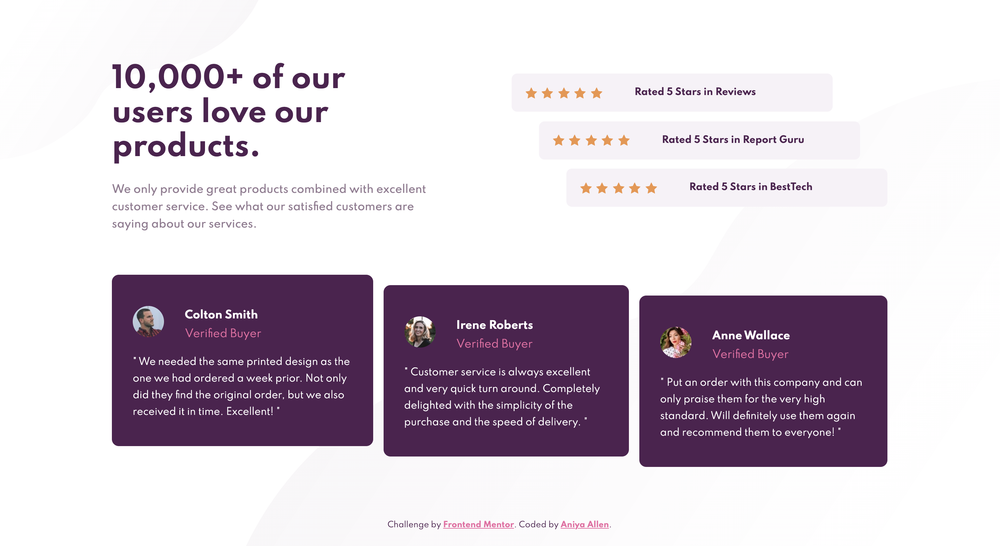

# Frontend Mentor - Social proof section solution

This is a solution to the [Social proof section challenge on Frontend Mentor](https://www.frontendmentor.io/challenges/social-proof-section-6e0qTv_bA). Frontend Mentor challenges help you improve your coding skills by building realistic projects.

## Table of contents

- [Overview](#overview)
  - [The challenge](#the-challenge)
  - [Screenshot](#screenshot)
  - [Links](#links)
- [My process](#my-process)
  - [Built with](#built-with)
  - [What I learned](#what-i-learned)
  - [Continued development](#continued-development)
  - [Useful resources](#useful-resources)
- [Author](#author)
- [Acknowledgments](#acknowledgments)

## Overview

### The challenge

Users should be able to:

- View the optimal layout for the section depending on their device's screen size

### Screenshot

| Mobile (375px)                              | Desktop (1440px)                              |
| ------------------------------------------- | --------------------------------------------- |
|  |  |

### Links

- Solution URL: [Github repo](https://github.com/amallen1/social-proof)
- Live Site URL: [Live site](https://affectionate-albattani-30a750.netlify.app/)

## My process

### Built with

- Semantic HTML5 markup
- SCSS
- Flexbox
- CSS Grid
- Mobile-first workflow

### What I learned

I learned how to use CSS and Flexbox together a little more seamlessly. During this project I also learned about
file architecture when it comes to using SASS. I used to just use one large Sass file but I'm learning for more complex projects and to be organized in general it's best to split files up.

Also one of the biggest obstacles for me during this challenge was understanding when to use Flexbox vs Grid. Flexbox made it really easy to create the mobile version of the design, but I was a little overwhelemed when I had to implement the design for tablets and desktop screen sizes. I finally came to the conclusion that grid helped me to structure the layout of the design in the right places, and flexbox helped me to move them around within those containers so that it could look similar to the design.

### Continued development

--

### Useful resources

- [Traversy Media's Youtube Video](https://www.youtube.com/watch?v=nu5mdN2JIwM&ab_channel=TraversyMedia) - This video helped me to understand the file structure that is best practice when using SASS.

- [Kevin Powell's Youtube Video](https://www.youtube.com/watch?v=K27WULzr2P8&ab_channel=KevinPowell) - Kevin Powell's solution helped me to understand better how to organize the structure of CSS grid code so that it could work well with flexbox.

## Author

- Frontend Mentor - [@amallen1](https://www.frontendmentor.io/profile/amallen1)

## Acknowledgments

- Kevin Powell

I really look up to Kevin Powell and I know that he has a lot of experience with CSS. I was having trouble understanding how to transition from mobile screen to desktops while making sure the design looks good responsively.
